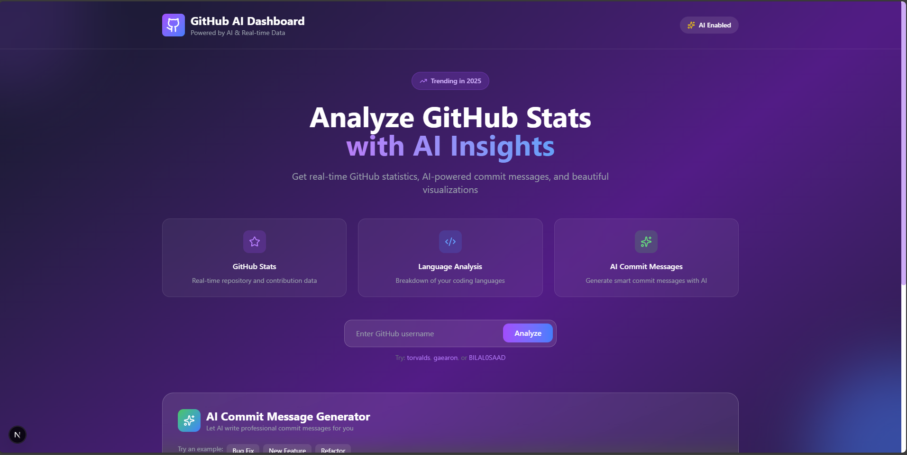

# 🤖 GitHub AI Dashboard

<div align="center">



[](https://nextjs.org/)
[](https://www.typescriptlang.org/)
[](https://tailwindcss.com/)
[](https://openai.com/)

**An AI-powered GitHub analytics dashboard with real-time statistics and intelligent commit message generation**

[Live Demo](https://github-ai-dashboard-v99.vercel.app/) • [Report Bug](https://github.com/BILAL0SAAD/github-ai-dashboard/issues) • [Request Feature](https://github.com/BILAL0SAAD/github-ai-dashboard/issues)

</div>

---

## ✨ Features

- 📊 **Real-Time GitHub Stats** - Visualize repositories, stars, forks, and followers instantly
- 🤖 **AI Commit Messages** - Generate professional commit messages using OpenAI GPT-3.5
- 📈 **Language Analytics** - Interactive breakdown of programming languages with percentages
- ⭐ **Top Repositories** - Showcase your most starred projects with engagement metrics
- 🎭 **Glassmorphism UI** - Modern design with gradients, blur effects, and smooth animations
- 📱 **Fully Responsive** - Optimized for desktop, tablet, and mobile devices

---

## 🚀 Live Demo

**[Try it now →](https://your-vercel-url.vercel.app)**

Test with these usernames: `BILAL0SAAD`, `torvalds`, `gaearon`

---

## 🛠️ Tech Stack

- **Next.js 14** - React framework with App Router
- **TypeScript** - Type-safe JavaScript
- **Tailwind CSS** - Utility-first styling
- **OpenAI API** - GPT-3.5 for AI features
- **GitHub API** - Real-time data via Octokit
- **Vercel** - Deployment platform

---

## 🔧 Installation

### Prerequisites

- Node.js 18+
- npm or yarn
- OpenAI API key

### Setup

```bash
# Clone repository
git clone https://github.com/BILAL0SAAD/github-ai-dashboard.git
cd github-ai-dashboard

# Install dependencies
npm install

# Create .env.local file
echo "OPENAI_API_KEY=your-key-here" > .env.local

# Run development server
npm run dev
```

Open [http://localhost:3000](http://localhost:3000)

---

## 🚀 Deployment

### Deploy to Vercel

1. Push code to GitHub
2. Go to [vercel.com](https://vercel.com)
3. Import repository
4. Add `OPENAI_API_KEY` environment variable
5. Deploy!

---

## 📁 Project Structure

```
github-ai-dashboard/
├── app/
│   ├── page.tsx                 # Main page
│   ├── globals.css              # Styles
│   └── api/generate-commit/     # API route
├── components/
│   ├── GitHubStats.tsx          # Stats component
│   └── AICommitGenerator.tsx    # AI component
└── .env.local                   # Environment variables
```

---

## 🎯 Usage

1. **Analyze Profile**: Enter GitHub username → Click "Analyze"
2. **View Stats**: See repositories, stars, languages, top projects
3. **Generate Commits**: Describe changes → Get AI-generated message

---

## 👨‍💻 Author

**Bilal Saad**

- Portfolio: [my-portfolio-seven-kappa-31.vercel.app](https://my-portfolio-seven-kappa-31.vercel.app)
- LinkedIn: [Belal Saad](https://www.linkedin.com/in/belal-saad-9455a7321/)
- GitHub: [@BILAL0SAAD](https://github.com/BILAL0SAAD)
- Email: belalsaad2001@gmail.com

---

## 📄 License

MIT License - see [LICENSE](LICENSE) for details

---

<div align="center">

**Made with ❤️ and AI**

⭐ Star this repo if you found it helpful!

</div>
